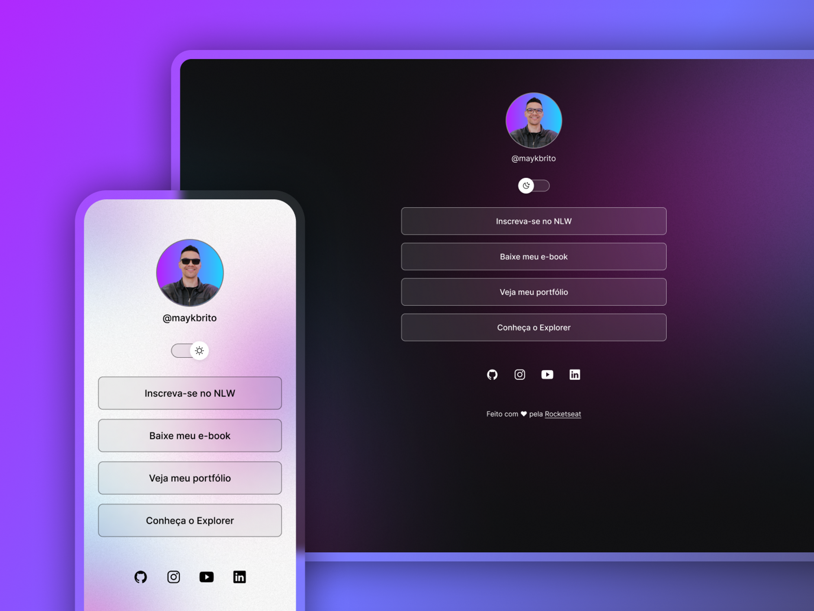

<h1 align="center">Projeto Devlinks</h1>

Projeto dado e desenvolvido pelo curso da Rocketseat focado em desenvolvimento web.

  <a href="#-tecnologias">Tecnologias</a>&nbsp;&nbsp;&nbsp; | &nbsp;&nbsp;&nbsp;
    <a href="#-projeto">Projeto</a>&nbsp;&nbsp;&nbsp; | &nbsp;&nbsp;&nbsp;
    <a href="#-layout">Layout</a>&nbsp;&nbsp;&nbsp; | &nbsp;&nbsp;&nbsp;
    <a href="#memo-licença">Licenças</a>&nbsp;&nbsp;&nbsp; | &nbsp;&nbsp;&nbsp;

  

## Tecnologias utilizadas

-HTML e CSS
-JavaScript
-Git e Github

## Projeto

O projeto faz parte do curso da RocketSeat que ensina desde o zero o desenvolvimento da parte do front-end, o projeto é um cartão de visitas online que agrega alguns links.

## Layout

Você pode visualizar o projeto [NESSE LINK] (https://www.figma.com/file/nRDIaeKvq7v4Xs1Z9NfGBf/DevLinks-%E2%80%A2-Projeto-Discover-(Community)?type=design&node-id=10-620&mode=design&t=wHKLRTqoWzvlwDsg-0)
